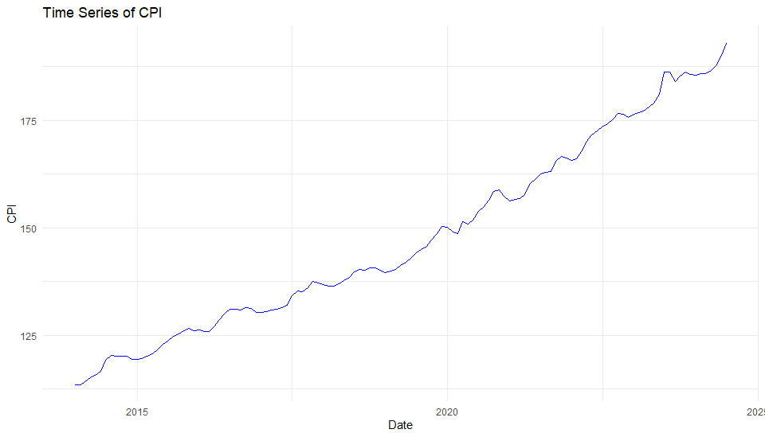
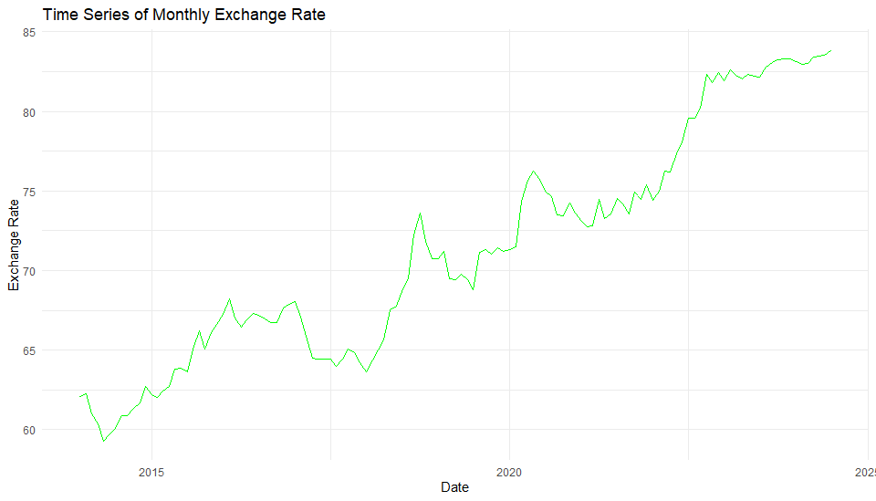
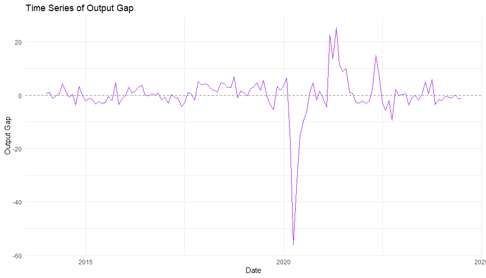
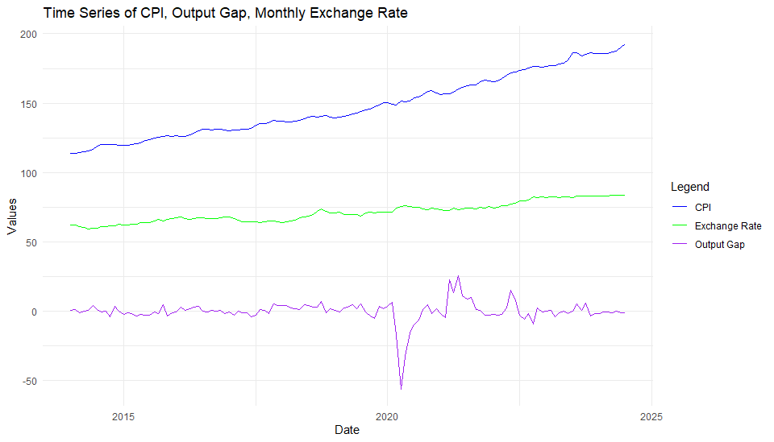
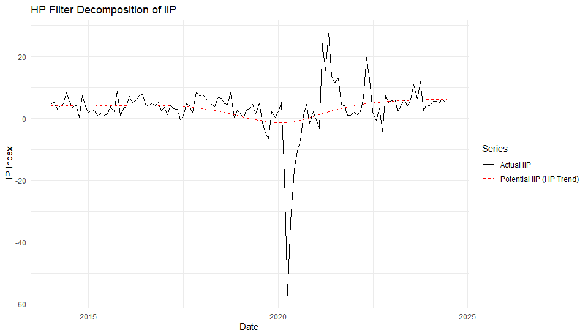
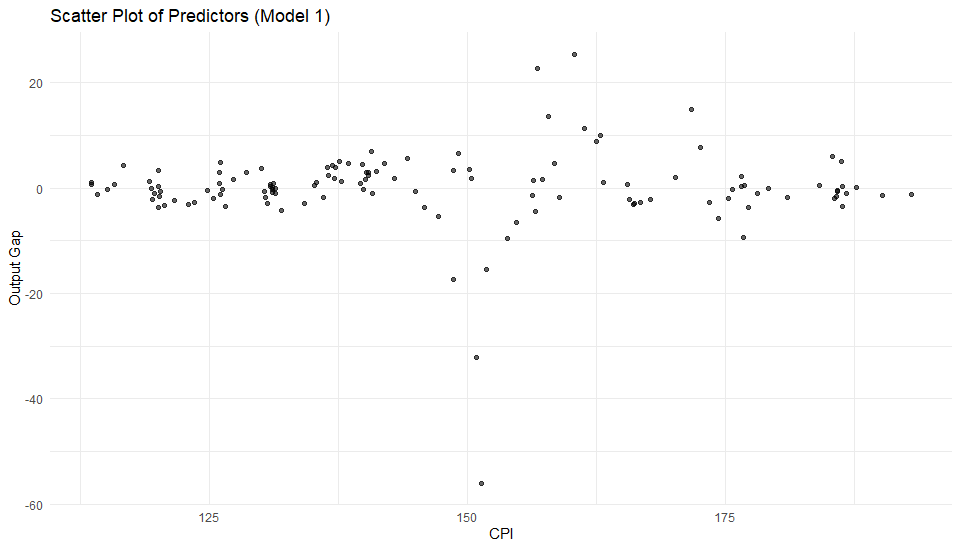
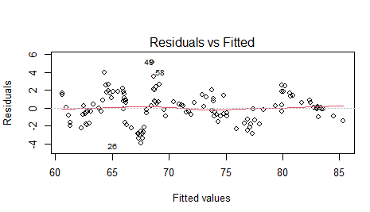
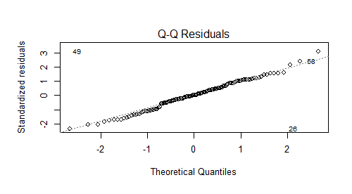
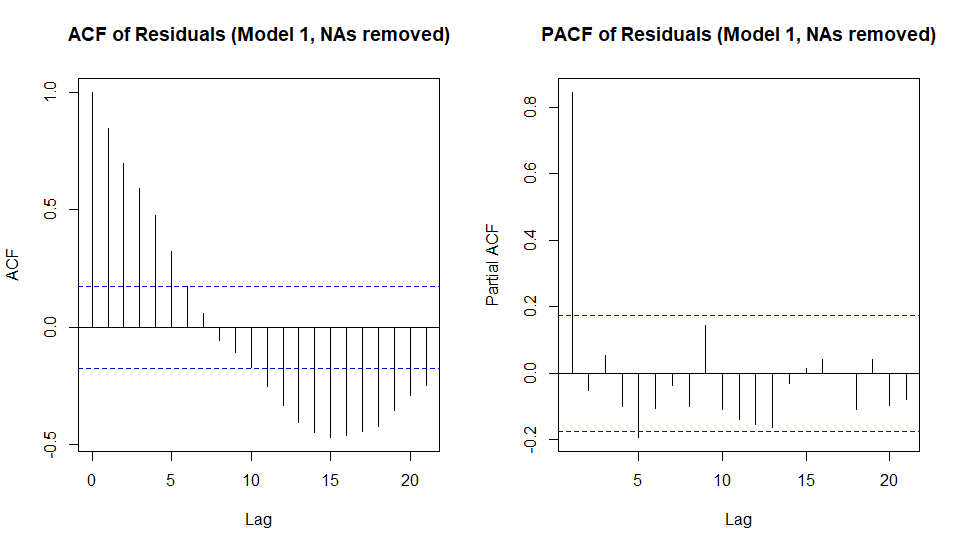
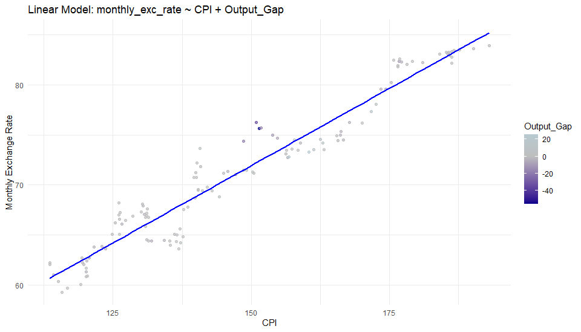

# Analysis of Indian Rupee Exchange Rate: Impact of CPI and Output Gap

## 1. Introduction

### 1.1 Background and Motivation
As India strives for economic growth and development, managing key economic indicators is crucial. The exchange rate, representing the value of the Rupee internationally, is vital for trade competitiveness and attracting investment. Domestically, policymakers closely monitor inflation (Consumer Price Index - CPI) and the overall pace of economic activity. This study investigates the link between domestic inflation, **the momentum of industrial activity (proxied by a "growth gap" derived from the Index of Industrial Production - IIP's month-over-month growth rate)**, and movements in the monthly Indian Rupee (INR) exchange rate. This analysis is pertinent to macroeconomic policy and its impact.

### 1.2 Research Problem/Question
How do domestic inflation, as measured by the Consumer Price Index (CPI), and the cyclical position of **industrial activity's growth momentum, proxied by a "growth gap" derived from the month-over-month percentage growth rate of the Index of Industrial Production (IIP)**, influence the monthly Indian Rupee (INR) exchange rate?

### 1.3 Objectives of the Study
1.  To empirically estimate the relationship between the monthly INR exchange rate and the CPI.
2.  To estimate the relationship between the monthly INR exchange rate and the **"growth gap" (derived from the month-over-month percentage growth rate of IIP using the Hodrick-Prescott filter)**.
3.  To compare the explanatory power of the **"growth gap" versus the actual IIP month-over-month growth rate and the trend IIP month-over-month growth rate.**
4.  To interpret findings within relevant economic theories (e.g., Purchasing Power Parity).
5.  To ensure robust statistical inference by diagnosing model assumptions and applying corrections like Heteroskedasticity and Autocorrelation Consistent (HAC) standard errors.

### 1.4 Scope and Limitations
This study focuses on the monthly INR/USD exchange rate, CPI, and a **"growth gap" derived from the month-over-month percentage growth rate of IIP** (using HP filter) for India, with data from **January 2014 to July 2024**. The primary methodology is Ordinary Least Squares (OLS) in a dynamic linear model framework, with diagnostics (VIF, Breusch-Pagan, Durbin-Watson) and Newey-West HAC standard errors.

**Limitations:**
*   Omits some determinants (interest rate differentials, capital flows, global factors).
*   HP filter has known limitations (end-point sensitivity, smoothing parameter choice), **and its application to growth rates (rather than levels) along with the standard smoothing parameter (λ=14400) are methodological considerations.**
*   **The IIP month-over-month growth rate as a proxy for overall economic momentum** doesn't fully capture the large service sector.
*   Assumes linear relationships; serial correlation, though corrected, might suggest more complex models.
*   Findings are specific to the chosen data period.

## 2. Theoretical Framework (Brief Overview)
The study draws upon:
*   **Purchasing Power Parity (PPP):** Links price levels (CPI) to exchange rates. Relative PPP suggests `%ΔS ≈ π - π*`, implying higher domestic inflation leads to currency depreciation. This predicts a positive relationship between CPI and the exchange rate (INR/USD).
*   **Output Gap (interpreted as "Growth Gap") and Exchange Rate Linkages:** In this study, the "Output Gap" or "Growth Gap" represents the deviation of monthly IIP growth from its trend.
    *   **Interest Rate Channel:** A positive "Growth Gap" (actual MoM growth > trend MoM growth), indicating accelerating industrial activity, could lead to expectations of tighter monetary policy, higher interest rates, capital inflows, and currency appreciation (negative relationship between "Growth Gap" and INR/USD).
    *   **Capital Flows/Confidence Channel:** A positive "Growth Gap" can signal strengthening economic performance, boosting confidence, attracting investment, and leading to currency appreciation (negative relationship).
    *   **Current Account Channel:** A positive "Growth Gap" might increase import demand due to higher activity/income, potentially leading to currency depreciation (positive relationship), but often dominated by capital account effects.

## 3. Data and Methodology

### 3.1 Data Sources and Description
Monthly time series data for India (January 2014 - July 2024):
1.  **Monthly Exchange Rate (monthly_exc_rate):** Monthly average INR/USD spot rate (INR per USD). Source: RBI DBIE.
2.  **Consumer Price Index (CPI):** All India CPI (Combined: Rural + Urban). Base year: 2012=100. Source: NSO, MoSPI.
3.  **Industrial Production Growth (Actual_IIP):** The **monthly month-over-month percentage growth rate** of the Index of Industrial Production. Source: NSO, MoSPI.

### 3.2 Variable Construction: HP Filter and "Growth Gap" (formerly Output Gap)
The Hodrick-Prescott (HP) filter was applied to the `Actual_IIP` **(month-over-month percentage growth rate series)** to derive:
*   **Potential IIP Growth (Potential_IIP):** Trend component (τt), representing the **estimated underlying trend in monthly industrial production growth.**
*   **"Growth Gap" (Output_Gap):** Cyclical component (ct), calculated as `Actual_IIP - Potential_IIP`. This represents the **deviation of the actual month-over-month IIP growth rate from its estimated trend growth rate.**
A smoothing parameter λ = 14400 was used for monthly data.

### 3.3 Time Series Behavior of Key Variables

*(Caption remains the same)*

*(Caption remains the same)*

*(Caption: Figure 3.3: Time Series of "Growth Gap" (Deviation of MoM IIP Growth from Trend, pp))*

*(Caption: Figure 3.4: Combined Time Series of CPI, "Growth Gap", and Monthly Exchange Rate ([Start Date] - [End Date]))*

### 3.4 Visualizing the HP Filter Decomposition

*(Caption: Figure 3.5: HP Filter Decomposition of MoM IIP Growth Rate (Actual vs Potential Growth))*

### 3.5 Econometric Model Specification
1.  **Model 1 ("Growth Gap" Model - Preferred):** `monthly_exc_rate_t = β₀ + β₁*CPI_t + β₂*Output_Gap_t + ε₁_t` (Referred to as `igd_model`. Note: `Output_Gap` here refers to the "Growth Gap".)
2.  **Model 2 (Actual IIP Growth Model):** `monthly_exc_rate_t = γ₀ + γ₁*CPI_t + γ₂*Actual_IIP_t + ε₂_t` (Note: `Actual_IIP` is MoM % growth)
3.  **Model 3 (Potential IIP Growth Model):** `monthly_exc_rate_t = δ₀ + δ₁*CPI_t + δ₂*Potential_IIP_t + ε₃_t` (Note: `Potential_IIP` is trend MoM % growth)

### 3.6 Estimation Method and Diagnostics
Models were estimated using OLS via the `dynlm` package in R.
Diagnostic tests on Model 1:
*   Variance Inflation Factor (VIF) for multicollinearity.
*   Breusch-Pagan Test for heteroskedasticity.
*   Durbin-Watson (DW) Test for first-order serial autocorrelation.
Newey-West HAC standard errors were computed to address autocorrelation using `coeftest` (from `lmtest`) and `NeweyWest` (from `sandwich`).

## 4. Empirical Results

### 4.1 Initial OLS Regression Results (Summary)
**Table 4.1: Initial OLS Estimation Results**
*(Dependent Variable: monthly_exc_rate)*

|                     | Model 1 ("Growth Gap")       | Model 2 (Actual IIP Growth)  | Model 3 (Potential IIP Growth)|
|---------------------|:----------------------------:|:----------------------------:|:----------------------------:|
| **Variables**       |                              |                              |                              |
| (Intercept)         | 25.600582***                 | 25.594238***                 | 25.609262***                 |
|                     | (1.001463)                   | (1.001698)                   | (1.066650)                   |
| CPI                 | 0.308907***                  | 0.310579***                  | 0.310653***                  |
|                     | (0.006701)                   | (0.006716)                   | (0.007326)                   |
| Output_Gap ("Growth Gap")| -0.081020***            |                              |                              |
|                     | (0.019044)                   |                              |                              |
| Actual_IIP (MoM % Growth)|                       | -0.074965***                 |                              |
|                     |                              | (0.017653)                   |                              |
| Potential_IIP (Trend MoM % Growth)|                |                              | -0.083017                    |
|                     |                              |                              | (0.073799)                   |
|                     |                              |                              |                              |
| **Diagnostics**     |                              |                              |                              |
| N                   | 127                          | 127                          | 127                          |
| R-squared           | 0.9453                       | 0.9452                       | 0.9379                       |
| Adjusted R-squared  | 0.9444                       | 0.9444                       | 0.9369                       |
| F-statistic         | 1071                         | 1070                         | 936.7                        |
| *p-value (F-stat)*  | < 2.2e-16                    | < 2.2e-16                    | < 2.2e-16                    |

---
* *OLS Standard Errors in parentheses.*
* *Significance codes: 0 ‘\*\*\*’ 0.001 ‘\*\*’ 0.01 ‘\*’ 0.05 ‘.’ 0.1 ‘ ’ 1*
* *(Note: N is inferred from degrees of freedom for residuals (124) + number of parameters (3), so N = 127 for all models.)*

### 4.2 Diagnostic Test Results (Model 1: `igd_model`)
*   **Multicollinearity (VIF):** VIF values for CPI (~1.00) and "Growth Gap" (`Output_Gap` variable) (~1.00) were extremely low, indicating no multicollinearity.
    
*   **Heteroskedasticity (Breusch-Pagan Test):** BP statistic = [Insert BP Value from your specific R output for `bptest(igd_model)`], p-value = [Insert p-value from R output]. *(The conclusion "Failed to reject null..." depends on this p-value being > 0.05).*
*   **Autocorrelation (Durbin-Watson Test):** DW statistic ≈ 0.30 (p-value < 2.2e-16). Strong evidence of severe positive serial correlation in OLS residuals.

### 4.3 Robust Inference Results for Preferred Model (Model 1)
Given significant autocorrelation, Newey-West HAC standard errors were computed for Model 1.

**Table 4.2: Model 1 Results with HAC Standard Errors**
*(Dependent Variable: monthly_exc_rate)*

| Variable    | Estimate | HAC Std. Error | HAC t value | HAC Pr(>\|t\|) |
|-------------|:--------:|:--------------:|:-----------:|:--------------:|
| (Intercept) | 25.60058 | 1.98630        | 12.889      | < 2e-16 ***    |
| CPI         | 0.30891  | 0.01241        | 24.894      | < 2e-16 ***    |
| Output_Gap ("Growth Gap")| -0.08102 | 0.01289        | -6.284      | 5.11e-09 ***   |

---
* *Significance codes: 0 ‘\*\*\*’ 0.001 ‘\*\*’ 0.01 ‘\*’ 0.05 ‘.’ 0.1 ‘ ’ 1*
* *Residual standard error: 1.672 on 124 degrees of freedom*
* *Multiple R-squared: 0.9453, Adjusted R-squared: 0.9444*
* *F-statistic (based on HAC covariance): 327.9 on 2 and 124 DF, p-value: < 2.2e-16*

## 5. Discussion and Interpretation

### 5.1 Interpretation of Preferred Model (Model 1 - Based on HAC Results)
*   **Consumer Price Index (CPI):** Coefficient ≈ +0.309 (p < 0.001 with HAC errors). A one-unit increase in CPI is associated with an approx. 0.31 unit increase in INR/USD (depreciation), consistent with Relative PPP.
*   **"Growth Gap" (Output_Gap variable):** Coefficient ≈ -0.081 (p < 0.001 with HAC errors). A one percentage point increase in the "Growth Gap" (i.e., actual MoM IIP growth being 1 pp above its trend growth) is associated with an approximate 0.081 unit decrease in the INR/USD exchange rate (appreciation). This supports theories linking accelerated economic momentum to currency strength via interest rate and capital flow/confidence channels.
*   **Intercept:** Statistically significant but primarily serves to adjust the regression line level.

### 5.2 Comparison of Models
The initial OLS comparison (Section 4.1) showed that models with the cyclical component of **IIP's month-over-month growth** ("Growth Gap" in Model 1, `Actual_IIP` MoM growth in Model 2) performed better than the model with only the trend **IIP month-over-month growth** (`Potential_IIP` in Model 3). This suggests the cyclical aspect of industrial activity's growth momentum is key for exchange rate movements in this framework. Model 1 is preferred for its explicit isolation of this cyclical growth factor.

### 5.3 Discussion of Model Fit and Diagnostics
*   **Overall Fit (Model 1):** Adjusted R² ≈ 0.944 (from initial OLS), indicating CPI and the "Growth Gap" together explain about 94.4% of the variation in the monthly exchange rate.
*   **Multicollinearity & Heteroskedasticity:** No significant issues with multicollinearity. Heteroskedasticity conclusion depends on the specific Breusch-Pagan test result for your `igd_model`.
*   **Autocorrelation and HAC Correction:** Severe positive autocorrelation in OLS residuals was found. Newey-West HAC standard errors confirmed the statistical significance of both CPI and the "Growth Gap," making the core conclusions robust to serial correlation.

### 5.4 Residual Analysis (Visual Diagnostics for Model 1 OLS Residuals)

*(Caption: Figure 5.1: Residuals vs. Fitted Values Plot (Model 1). Supports homoskedasticity if consistent with Breusch-Pagan test)*

*(Caption: Figure 5.2: Normal Q-Q Plot of Residuals (Model 1). Suggests residuals are approximately normally distributed, with minor tail deviations)*

*(Caption: Figure 5.3: ACF and PACF Plots of Residuals (Model 1). Confirms strong positive serial autocorrelation, corroborating DW test)*

### 5.5 Visual Evidence of Main Relationships (Model 1)

*(Caption: Figure 5.4: Monthly Exchange Rate vs. CPI, Colored by "Growth Gap". Visually confirms the positive relationship between CPI and exchange rate, and the moderating effect of the "Growth Gap")*

## 6. Conclusion and Suggestions

### 6.1 Summary of Findings
1.  **CPI:** Statistically significant positive relationship with the INR/USD exchange rate (depreciation), consistent with Relative PPP.
2.  **"Growth Gap" (derived from MoM IIP growth):** Statistically significant negative relationship with the INR/USD exchange rate (appreciation), supporting theories linking accelerated economic momentum to currency strength.
3.  **Cyclical vs. Trend (of MoM IIP Growth):** The cyclical component of IIP's month-over-month growth ("Growth Gap") has significant explanatory power, while the underlying trend component of MoM growth (`Potential_IIP`) does not, within this framework.
4.  **Model Fit:** The preferred model (CPI + "Growth Gap") explains a large proportion (Adj. R² ≈ 0.944) of monthly exchange rate variation.
*All key relationships remain significant after correcting for autocorrelation using HAC standard errors.*

### 6.2 Policy Implications (Tentative)
*   **Inflation Control:** Strong CPI-exchange rate link highlights the importance of price stability for managing exchange rate volatility and external competitiveness.
*   **Cyclical Momentum Management:** The significant impact of the "Growth Gap" suggests that managing the momentum of the domestic industrial cycle is pertinent to exchange rate outcomes.
*   **Holistic Policy View:** Achieving external sector goals likely requires sound domestic macroeconomic management influencing inflation and economic growth momentum.

### 6.3 Limitations of the Study
*   Omitted variables (interest rates, capital flows, global factors).
*   HP filter limitations, especially its application to growth rates and the choice of smoothing parameter.
*   IIP month-over-month growth as an imperfect proxy for overall economic momentum, potentially missing service sector dynamics.
*   Presence of autocorrelation suggesting potential for more complex dynamic models.
*   Linearity assumption.

### 6.4 Scope for Future Research
*   Include additional explanatory variables.
*   Employ alternative measures of economic momentum or "growth gaps."
*   Utilize advanced dynamic modeling techniques (VAR, VECM, ARMA errors).
*   Conduct sectoral analysis.
*   Analyze relationships over extended or different data periods.

